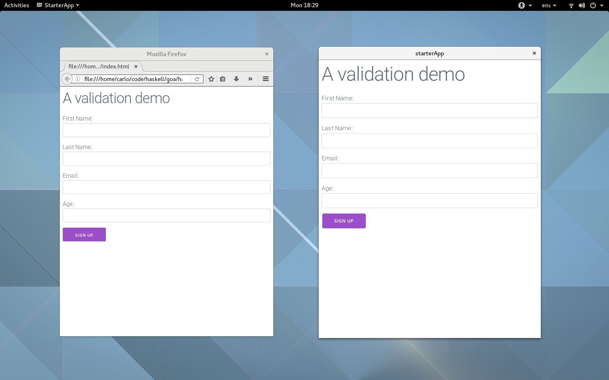

.. _getting_started

Getting Started with Reflex
===========================

In this first installment of the reflex tour, we'll set up a stack-based
infrastructure for compiling reflex programs, see some basic code, and see how
we can compile and minify our app.

Quick Start
-----------

Contrary to the standard way of installing reflex, which is based on the ``nix``
package manager, we'll focus on a ``stack`` based installation. The repo for
this tutorial is `here
<https://github.com/vacationlabs/haskell-webapps/tree/master/UI/ReflexFRP/starterApp>`_.

Clone the entire repo, move to that folder and launch these installation steps:

* ``stack build gtk2hs-buildtools``
* Be sure to have the required system libraries (like ``webkitgtk``). If you
  miss some of the libraries, they will pop up as error in the next step, and
  you can install the missing ones
* Build with ghc: ``stack build``
* Execute the desktop app: ``stack exec userValidation``
* Build with ghcjs: ``./deploy.sh``  
* Execute the web app: ``firefox js/index.html``

* TODO: check that this works on macOS

While all this builds (it will be a fairly lengthy process the first time), if
you are a new reflex user, be sure to check the `beginners tutorial
<https://github.com/reflex-frp/reflex-platform>`_ (if you want an installation
process based on stack for the same code, check out `here
<https://github.com/meditans/stack-reflex-webkitgtk>`_.

and the two quick-start
references that will constitute most of the function we'll use in this series
(for both `reflex
<https://github.com/reflex-frp/reflex/blob/develop/Quickref.md>`_ and
`reflex-dom
<https://github.com/reflex-frp/reflex-dom/blob/develop/Quickref.md>`_).

You can see that there are two files: a `stack.yaml
<https://github.com/vacationlabs/haskell-webapps/blob/master/UI/ReflexFRP/starterApp/stack.yaml>`_
and a `stack-ghcjs.yaml
<https://github.com/vacationlabs/haskell-webapps/blob/master/UI/ReflexFRP/starterApp/stack-ghcjs.yaml>`_.
Both contain the same version of the libraries we're using, but with this setup
we get a desktop app for free (built using webkit), and we're able to use tools
for checking the code (like ``intero`` or ``ghc-mod``) that don't yet directly
support ghcjs.

Here below you can see the two versions of the app:

A look at the code
-----------------------

The first objective that this file has is to show how to deal with the fact that
sometimes we don't want our values to be updated continuously: for example when
designing a form, we want the feedback from the program to happen only when something happens (like, the login button is clicked, or the user navigates away from the textbox

Let's begin commenting the main function:

.. literalinclude:: ../../../UI/ReflexFRP/starterApp/Main.hs
   :language: haskell
   :lines: 31-40

The first function we'll going to see is:

.. code-block:: haskell

  mainWidgetWithHead :: (forall x. Widget x ()) -> (forall x. Widget x ()) -> IO () 

This is the type of a ``Widget``:

.. code-block:: haskell

  type Widget x = PostBuildT Spider
                     (ImmediateDomBuilderT Spider
                       (WithWebView x
                         (PerformEventT Spider
                           (SpiderHost Global)))) 

(it's a bit scary, but I want to introduce it here because there is an error
that happens sometimes when not constraing the monad enough, and this is the key
to understand that. TODO, flesh out this section)

You don't need to concern yourself with the exact meaning of this, it's just a
convenient way to talk about a monadic transformer which hold the semantics
together. Usually we just pass to that function an argument of type
``MonadWidget t m => m ()``, as you can see from:

.. literalinclude:: ../../../UI/ReflexFRP/starterApp/Main.hs
   :language: haskell
   :lines: 24-29

In which we import the css files we need from a cdn.

As you can see, the structure of the main function denotates the components of
this simple app, giving a name to the return values.

Note that the ``RecursiveDo`` pragma lets us use the return value of the button
before of his definition. It's useful to think at the main as having the
following meaning: in the first pass, the widgets are constructed, and
subsequently the reactive network continues the elaboration (TODO: I'm not sure
to include this visualization).

The most important functions are ``validateInput`` and ``notifyLogin``, defined below:

.. literalinclude:: ../../../UI/ReflexFRP/starterApp/Main.hs
   :language: haskell
   :lines: 75-79

The ``validateInput`` function is directly responsable for the rendering of the
label, using the pure function to validate the data, and change the value
reported back to the caller as soon as the button is pressed.

On the other hand, the function:

.. literalinclude:: ../../../UI/ReflexFRP/starterApp/Main.hs
   :language: haskell
   :lines: 103-104

is responsible for drawing the notification for the successful login as it
happens.

With these suggestions in mind, you can read directly the `source code
<https://github.com/vacationlabs/haskell-webapps/blob/master/UI/ReflexFRP/starterApp/Main.hs>`_
which is thoroughly commented.

Simple deployment
----------------------------

The ghcjs compiler by default generates some extra code dealing with ``node``
bindings: as we want only the webapp here, the first pass in the optimization is
using the ``-DGHCJS_BROWSER`` option to strip the node code from the generated
executable. We also use the new ``-dedupe`` flags that optimizes for generated
size. All this is accomplished in this section of the `cabal file
<https://github.com/vacationlabs/haskell-webapps/blob/master/UI/ReflexFRP/starterApp/starterApp.cabal>`_:

.. literalinclude:: ../../../UI/ReflexFRP/starterApp/starterApp.cabal
   :language: haskell
   :lines: 19-23

The next step will be using google's ``closure compiler`` to minify the compiles
javascript, and then google's ``zopfli`` to gzip it; go ahead and install those
tools (I just did ``sudo dnf install ccjs zopfli`` on fedora, but you can find
the relevant instructions on their github pages).

I included a simple deployment script to show how you could compile and minify
your app (I'm purposefully creating a simple bash script, there are much more
things you can do, check them at `ghcjs deployment page
<https://github.com/ghcjs/ghcjs/wiki/Deployment>`_).

.. literalinclude:: ../../../UI/ReflexFRP/starterApp/deploy.sh
   :language: bash

Here's the relevant output of ``ls -alh js``, to show the size of the generated files:

.. code-block:: bash

  -rw-r--r--. 1 carlo carlo 3.0M Dec 12 17:16 all.js
  -rw-rw-r--. 1 carlo carlo 803K Dec 12 17:17 all.min.js
  -rw-rw-r--. 1 carlo carlo 204K Dec 12 17:17 all.min.js.gz

So, the final minified and zipped app is about 204 Kb, not bad since we have to
bundle the entire ghc runtime (and that's a cost that we only pay once,
regardless of the size of our application).

We could also wonder if we have a size penalty from the fact that I used
`classy-prelude` instead of manually importing all the required libraries.
So I did an alternative benchmark, and it turns out that that's not the case:

.. code-block:: bash

  -rw-r--r--. 1 carlo carlo 3.1M Dec 12 17:35 all.js
  -rw-rw-r--. 1 carlo carlo 822K Dec 12 17:35 all.min.js
  -rw-rw-r--. 1 carlo carlo 206K Dec 12 17:35 all.min.js.gz

As you can see, the difference is really minimal. In fact, all the size is
probably taken up by the encoding of the ghc runtime.
